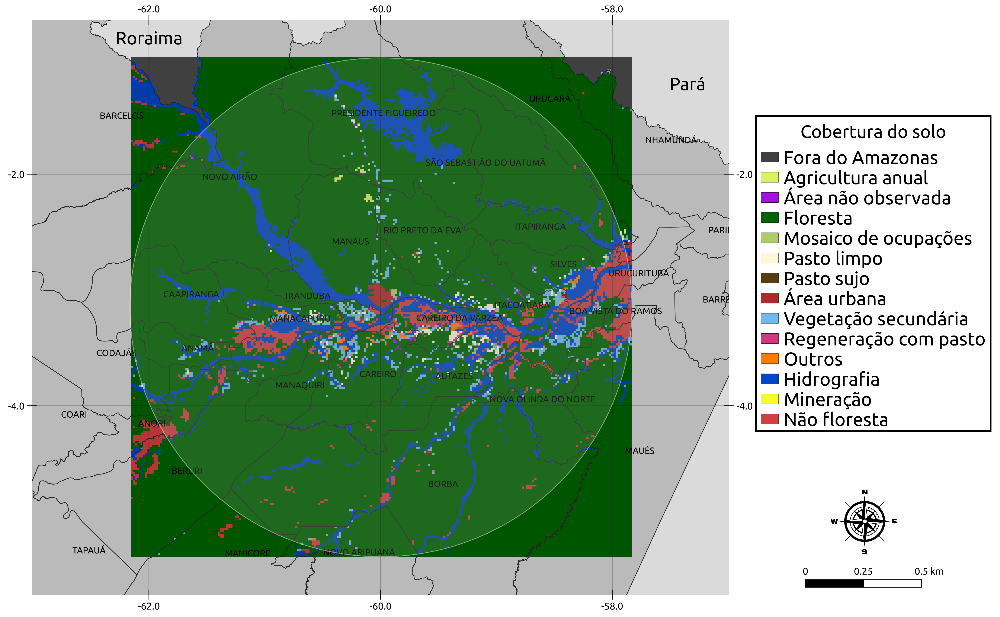
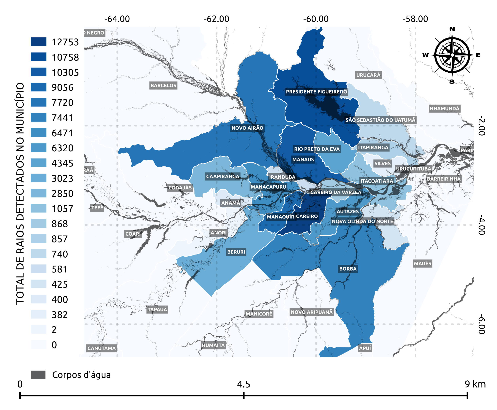

# Metodologia

Neste seção, serão descritas as etapas metodológicas utilizadas no 
desenvolvimento deste trabalho.


## Contextualização da área de estudo

Para este trabalho foram utilizados os dados do radar meteorológico SIPAM 
(Sistema de Proteção da Amazônia) [@saraiva2016regional] e da rede de detecção 
de raios LINET (sigla do inglês, *Lightning NETwork*) [@betz2009linet]. Os dados 
são oriundos dos experimentos CHUVA-Manaus [@machado2014chuva] e GoAmazon 
[@martin2016introduction] que aconteceu no ano de 2014 na região central da 
Bacia Amazônica. O conjunto de dados, também é resultado do processamento feito 
no trabalho de [@rebeca2019propriedades], afim de se calcular alguns outros 
índices, para isso, foi utilizada a ferramenta proposta por 
[@de2009monitoramento], que ser trata adaptação do algoritmo de rastreio de 
nuvens ForTraCC (*Forecast and Tracking of Active Convective Cells*) 
[@vila2008forecast].

Os dados possuem resolução temporal de 12 minutos, e foram obtidos durante o 
período de 27 de agosto a 7 de outubro em uma área de 500 km$^{2}$, cobrindo ao 
todo 20 municípios do estado do Amazonas. A floresta é o tipo de cobertura do 
solo predominante nessa região, e na área de estudo representa mais de 85\%, 
como pode ser observado na Figura \@ref(fig:landcover). Com isso, aumenta-se os 
riscos serem iniciados incêndios florestais em decorrência de raios nuvem-solo, 
principalmente no segundo Período de Operação Intensiva (IOP - sigla do inglês, 
*Intensive Operation Period*) [@marengo1994calculations], que corresponde a 
transição entre as estações seca e chuvosa, que acontece a partir do mês de 
agosto. É nesse perı́odo que acontecem tempestades mais severas, e 
consequentemente maiores incidências de descargas elétricas 
[@rebeca2019propriedades].


<div class="figure">

<p class="caption">(\#fig:landcover)Área de estudo e sua cobertura do solo.</p>
</div>


## Análise exploratória dos dados
Neste trabalho serão utilizados somente os dados de descargas atmosféricas da 
rede LINET, portanto, o período analisado será a partir do dia 29 de agosto a 07 
de outubro, que foi o tempo em que a rede esteve em operação durante os 
experimentos. Além dos dados das redes de detecção, compõe tabmbém o conjunto de 
dados, informações de radar. As informações do radar indicam os valores de 
alguns índices das nuvens. Os dados estão organizados em duas estruturas, na 
primeira estrutura, cada linha além dos valores dos índices detectados pelo 
radar, também possui a sua posição geográfica e seus índices associados a uma 
matriz com 241 linhas e 241 colunas. Na outra estrutura, as nuvens são agrupadas 
e as informações de seus índices são normalizadas. Daqui em diante, esses 
conjuntos de dados serão chamados de Mat e Fam, respectivamente.

Nesta seção serão feitas as devidas importações e também a análise exploratíoria
dos dados.

### Densidade e distribuição de raios

A célula abaixo faz a importação das bibliotecas que serão utilizadas na análise
dos dados.


```python
#importação das bibliotecas que serão utilizadas
import os
import numpy as np
import pandas as pd
from plotly.subplots import make_subplots
import plotly.graph_objects as go
import plotly
```

Como o foco deste trabalho é trabalhar com os dados da rede de detecção LINET, 
os dados carregados deverão ser filtrados, já que a rede esteve em funcionamento
somente durante um certo período do experimento. Sendo assim, a célula abaixo 
faz a importação e filtragem dos dados .

```python
#definindo arquivos para serem carregados
files = ['august.csv', 'september.csv', 'october.csv'] 
PATH ='../data/private/csv/fam/'

#Carregando e concatenando base de dados
df = [pd.read_csv(os.path.join(PATH, file)) 
      for file in files]
df = pd.concat(df, sort=False)
print('Total de registros carregados: %s'%df['month'].count())

#Filtrando base de dados
```

```
## Total de registros carregados: 53160
```

```python
query = '(month == 8 and day >= 27) or (month == 9) or (month == 10 and day <= 7)'
df = df.query(query)
print('Total de registros após a filtragem: %s'%df['month'].count())

#Exibindo primeiras linhas da base de dados
```

```
## Total de registros após a filtragem: 26218
```

```python
df.head()
```

```
##        time  sysclass   lat    lon    dir   vel  size  ...  meanprec  maxprec  year  month  day  hour  minute
## 12871   0.0       0.0 -2.75 -58.57 -999.0   0.0  13.0  ...      0.97     1.18  2014      8   27     2      24
## 12872   0.2       1.0 -2.73 -58.57    0.0  11.1  30.0  ...      1.80     4.16  2014      8   27     2      24
## 12873   0.0       0.0 -2.73 -58.57 -999.0   0.0  21.0  ...      1.02     1.32  2014      8   27     3       0
## 12874   0.2       1.0 -2.75 -58.57  180.0  11.1  13.0  ...      0.97     1.09  2014      8   27     3       0
## 12875   0.0       0.0 -1.71 -59.63 -999.0   0.0  12.0  ...      0.92     0.97  2014      8   27     3      48
## 
## [5 rows x 26 columns]
```

O código da célula abaixo mostra uma descrição básica de alguns índices do 
conjunto de dados.


```python
indexes = ['ttyyyxx3', 'riverfrac', 'convfrac', 'strafrac', 'meanz', 'maxz', 
            'meanvil', 'ttvil', 'meanprec', 'maxprec']
df[indexes].describe()
```

```
##            ttyyyxx3    riverfrac      convfrac      strafrac  ...       meanvil         ttvil      meanprec       maxprec
## count  26218.000000  26218.00000  26218.000000  26218.000000  ...  26218.000000  26218.000000  26218.000000  26218.000000
## mean       3.293691     10.87239     45.135574     54.864425  ...      1.022231    140.454784      6.696094     43.228542
## std       31.210997     19.20553     27.621304     27.621304  ...      0.926023    462.869909      7.353271     63.641824
## min        0.000000      0.00000      0.000000      0.000000  ...      0.160000      1.770000      0.820000      0.880000
## 25%        0.000000      0.00000     25.000000     37.930000  ...      0.370000     10.350000      1.940000      5.340000
## 50%        0.000000      0.00000     36.360000     63.640000  ...      0.690000     27.160000      4.020000     17.490000
## 75%        0.000000     13.64750     62.070000     75.000000  ...      1.350000     86.845000      8.940000     56.480000
## max     1493.000000    100.00000    100.000000    100.000000  ...     14.980000  13637.050000    168.770000    996.970000
## 
## [8 rows x 10 columns]
```
> **Nota**:  O atributo `ttyyyxx3` é referente a quantidade de raios detectados
> pela rede LINET a cada 12 minutos.

O código da célula abaixo tem como objetivo gerar um gráfico com a quantidade de
registro em que foram detectados raios e quantidade de registros em que não 
foram detectados raios.


```python
#Separando registros com e sem detecções de raios
no = df[df['ttyyyxx3'] < 1]
yes = df[df['ttyyyxx3'] >= 1]

#Contando quantidade de registros em cada subconjunto de dados
tn = no['month'].count()
ty = yes['month'].count()

#Organizando dados de entrada para o gráfico
labels = ['Sem raios detectados (%d)'%tn, 
         'Com raios detectados (%d)'%ty]
values= [tn, ty]

#Criando gráfico
fig = go.Figure()
fig.add_trace(
    go.Pie(labels=labels, values=values, hole=.5, 
        marker=dict(colors=['#000000', '#D82D3B'], 
                    line=dict(color='#A0A0A0', width=1)))
)

#Alterando layout do gráfico
```

```python
_ = fig.update_layout(
    title='<b>Gráfico 1</b>: Quantidade de registros com e sem detecção de \
    <br>descargas atmosféricas',
    template='plotly_dark',
    legend_orientation="v"
)

fig.show()
```


<!--html_preserve--><div id="htmlwidget-5f215049ee912c7bc11d" style="width:672px;height:480px;" class="plotly html-widget"></div>
<script type="application/json" data-for="htmlwidget-5f215049ee912c7bc11d">{"x":{"data":[{"hole":0.5,"labels":["Sem raios detectados (22820)","Com raios detectados (3398)"],"marker":{"colors":["#000000","#D82D3B"],"line":{"color":"#A0A0A0","width":1}},"values":[22820,3398],"type":"pie","frame":null}],"layout":{"template":{"data":{"barpolar":[{"marker":{"line":{"color":"rgb(17,17,17)","width":0.5}},"type":"barpolar"}],"bar":[{"error_x":{"color":"#f2f5fa"},"error_y":{"color":"#f2f5fa"},"marker":{"line":{"color":"rgb(17,17,17)","width":0.5}},"type":"bar"}],"carpet":[{"aaxis":{"endlinecolor":"#A2B1C6","gridcolor":"#506784","linecolor":"#506784","minorgridcolor":"#506784","startlinecolor":"#A2B1C6"},"baxis":{"endlinecolor":"#A2B1C6","gridcolor":"#506784","linecolor":"#506784","minorgridcolor":"#506784","startlinecolor":"#A2B1C6"},"type":"carpet"}],"choropleth":[{"colorbar":{"outlinewidth":0,"ticks":""},"type":"choropleth"}],"contourcarpet":[{"colorbar":{"outlinewidth":0,"ticks":""},"type":"contourcarpet"}],"contour":[{"colorbar":{"outlinewidth":0,"ticks":""},"colorscale":[[0,"#0d0887"],[0.111111111111111,"#46039f"],[0.222222222222222,"#7201a8"],[0.333333333333333,"#9c179e"],[0.444444444444444,"#bd3786"],[0.555555555555556,"#d8576b"],[0.666666666666667,"#ed7953"],[0.777777777777778,"#fb9f3a"],[0.888888888888889,"#fdca26"],[1,"#f0f921"]],"type":"contour"}],"heatmapgl":[{"colorbar":{"outlinewidth":0,"ticks":""},"colorscale":[[0,"#0d0887"],[0.111111111111111,"#46039f"],[0.222222222222222,"#7201a8"],[0.333333333333333,"#9c179e"],[0.444444444444444,"#bd3786"],[0.555555555555556,"#d8576b"],[0.666666666666667,"#ed7953"],[0.777777777777778,"#fb9f3a"],[0.888888888888889,"#fdca26"],[1,"#f0f921"]],"type":"heatmapgl"}],"heatmap":[{"colorbar":{"outlinewidth":0,"ticks":""},"colorscale":[[0,"#0d0887"],[0.111111111111111,"#46039f"],[0.222222222222222,"#7201a8"],[0.333333333333333,"#9c179e"],[0.444444444444444,"#bd3786"],[0.555555555555556,"#d8576b"],[0.666666666666667,"#ed7953"],[0.777777777777778,"#fb9f3a"],[0.888888888888889,"#fdca26"],[1,"#f0f921"]],"type":"heatmap"}],"histogram2dcontour":[{"colorbar":{"outlinewidth":0,"ticks":""},"colorscale":[[0,"#0d0887"],[0.111111111111111,"#46039f"],[0.222222222222222,"#7201a8"],[0.333333333333333,"#9c179e"],[0.444444444444444,"#bd3786"],[0.555555555555556,"#d8576b"],[0.666666666666667,"#ed7953"],[0.777777777777778,"#fb9f3a"],[0.888888888888889,"#fdca26"],[1,"#f0f921"]],"type":"histogram2dcontour"}],"histogram2d":[{"colorbar":{"outlinewidth":0,"ticks":""},"colorscale":[[0,"#0d0887"],[0.111111111111111,"#46039f"],[0.222222222222222,"#7201a8"],[0.333333333333333,"#9c179e"],[0.444444444444444,"#bd3786"],[0.555555555555556,"#d8576b"],[0.666666666666667,"#ed7953"],[0.777777777777778,"#fb9f3a"],[0.888888888888889,"#fdca26"],[1,"#f0f921"]],"type":"histogram2d"}],"histogram":[{"marker":{"colorbar":{"outlinewidth":0,"ticks":""}},"type":"histogram"}],"mesh3d":[{"colorbar":{"outlinewidth":0,"ticks":""},"type":"mesh3d"}],"parcoords":[{"line":{"colorbar":{"outlinewidth":0,"ticks":""}},"type":"parcoords"}],"scatter3d":[{"line":{"colorbar":{"outlinewidth":0,"ticks":""}},"marker":{"colorbar":{"outlinewidth":0,"ticks":""}},"type":"scatter3d"}],"scattercarpet":[{"marker":{"colorbar":{"outlinewidth":0,"ticks":""}},"type":"scattercarpet"}],"scattergeo":[{"marker":{"colorbar":{"outlinewidth":0,"ticks":""}},"type":"scattergeo"}],"scattergl":[{"marker":{"line":{"color":"#283442"}},"type":"scattergl"}],"scattermapbox":[{"marker":{"colorbar":{"outlinewidth":0,"ticks":""}},"type":"scattermapbox"}],"scatterpolargl":[{"marker":{"colorbar":{"outlinewidth":0,"ticks":""}},"type":"scatterpolargl"}],"scatterpolar":[{"marker":{"colorbar":{"outlinewidth":0,"ticks":""}},"type":"scatterpolar"}],"scatter":[{"marker":{"line":{"color":"#283442"}},"type":"scatter"}],"scatterternary":[{"marker":{"colorbar":{"outlinewidth":0,"ticks":""}},"type":"scatterternary"}],"surface":[{"colorbar":{"outlinewidth":0,"ticks":""},"colorscale":[[0,"#0d0887"],[0.111111111111111,"#46039f"],[0.222222222222222,"#7201a8"],[0.333333333333333,"#9c179e"],[0.444444444444444,"#bd3786"],[0.555555555555556,"#d8576b"],[0.666666666666667,"#ed7953"],[0.777777777777778,"#fb9f3a"],[0.888888888888889,"#fdca26"],[1,"#f0f921"]],"type":"surface"}],"table":[{"cells":{"fill":{"color":"#506784"},"line":{"color":"rgb(17,17,17)"}},"header":{"fill":{"color":"#2a3f5f"},"line":{"color":"rgb(17,17,17)"}},"type":"table"}]},"layout":{"annotationdefaults":{"arrowcolor":"#f2f5fa","arrowhead":0,"arrowwidth":1},"colorscale":{"diverging":[[0,"#8e0152"],[0.1,"#c51b7d"],[0.2,"#de77ae"],[0.3,"#f1b6da"],[0.4,"#fde0ef"],[0.5,"#f7f7f7"],[0.6,"#e6f5d0"],[0.7,"#b8e186"],[0.8,"#7fbc41"],[0.9,"#4d9221"],[1,"#276419"]],"sequential":[[0,"#0d0887"],[0.111111111111111,"#46039f"],[0.222222222222222,"#7201a8"],[0.333333333333333,"#9c179e"],[0.444444444444444,"#bd3786"],[0.555555555555556,"#d8576b"],[0.666666666666667,"#ed7953"],[0.777777777777778,"#fb9f3a"],[0.888888888888889,"#fdca26"],[1,"#f0f921"]],"sequentialminus":[[0,"#0d0887"],[0.111111111111111,"#46039f"],[0.222222222222222,"#7201a8"],[0.333333333333333,"#9c179e"],[0.444444444444444,"#bd3786"],[0.555555555555556,"#d8576b"],[0.666666666666667,"#ed7953"],[0.777777777777778,"#fb9f3a"],[0.888888888888889,"#fdca26"],[1,"#f0f921"]]},"colorway":["#636efa","#EF553B","#00cc96","#ab63fa","#FFA15A","#19d3f3","#FF6692","#B6E880","#FF97FF","#FECB52"],"font":{"color":"#f2f5fa"},"geo":{"bgcolor":"rgb(17,17,17)","lakecolor":"rgb(17,17,17)","landcolor":"rgb(17,17,17)","showlakes":true,"showland":true,"subunitcolor":"#506784"},"hoverlabel":{"align":"left"},"hovermode":"closest","mapbox":{"style":"dark"},"paper_bgcolor":"rgb(17,17,17)","plot_bgcolor":"rgb(17,17,17)","polar":{"angularaxis":{"gridcolor":"#506784","linecolor":"#506784","ticks":""},"bgcolor":"rgb(17,17,17)","radialaxis":{"gridcolor":"#506784","linecolor":"#506784","ticks":""}},"scene":{"xaxis":{"backgroundcolor":"rgb(17,17,17)","gridcolor":"#506784","gridwidth":2,"linecolor":"#506784","showbackground":true,"ticks":"","zerolinecolor":"#C8D4E3"},"yaxis":{"backgroundcolor":"rgb(17,17,17)","gridcolor":"#506784","gridwidth":2,"linecolor":"#506784","showbackground":true,"ticks":"","zerolinecolor":"#C8D4E3"},"zaxis":{"backgroundcolor":"rgb(17,17,17)","gridcolor":"#506784","gridwidth":2,"linecolor":"#506784","showbackground":true,"ticks":"","zerolinecolor":"#C8D4E3"}},"shapedefaults":{"line":{"color":"#f2f5fa"}},"sliderdefaults":{"bgcolor":"#C8D4E3","bordercolor":"rgb(17,17,17)","borderwidth":1,"tickwidth":0},"ternary":{"aaxis":{"gridcolor":"#506784","linecolor":"#506784","ticks":""},"baxis":{"gridcolor":"#506784","linecolor":"#506784","ticks":""},"bgcolor":"rgb(17,17,17)","caxis":{"gridcolor":"#506784","linecolor":"#506784","ticks":""}},"title":{"x":0.05},"updatemenudefaults":{"bgcolor":"#506784","borderwidth":0},"xaxis":{"automargin":true,"gridcolor":"#283442","linecolor":"#506784","ticks":"","zerolinecolor":"#283442","zerolinewidth":2},"yaxis":{"automargin":true,"gridcolor":"#283442","linecolor":"#506784","ticks":"","zerolinecolor":"#283442","zerolinewidth":2}}},"legend":{"orientation":"v"},"title":{"text":"<b>Gráfico 1<\/b>: Quantidade de registros com e sem detecção de     <br>descargas atmosféricas"},"hovermode":"closest","showlegend":true},"attrs":[],"highlight":{"on":"plotly_click","persistent":false,"dynamic":false,"selectize":false,"opacityDim":0.2,"selected":{"opacity":1},"debounce":0},"shinyEvents":["plotly_hover","plotly_click","plotly_selected","plotly_relayout","plotly_brushed","plotly_brushing","plotly_clickannotation","plotly_doubleclick","plotly_deselect","plotly_afterplot"],"base_url":"https://plot.ly"},"evals":[],"jsHooks":[]}</script><!--/html_preserve-->

Como mostrado no Gráfico 1, a quantidade de registros em que foram detectados 
raios é muito menor do que a quantidade de registros em que não foram detectados
raios. Nesse comjunto de dados, a quantidade de registros tende a diminuir
conforme aumenta a quantidade de detecções, ou seja, registros com muitos raios
detectados a cada 12 minutos, é muito menor que a quantidade de registros com
poucos raios detectados. Essa relação pode ser observado no Gráfico 2.


```python
#Contando a quantidade de registros em cada número de detecções
group = df.groupby(['ttyyyxx3']).agg({'ttyyyxx3': 'count'})

#Organizando dados de entrada para o gráfico
labels = [int(x) for x in group.index][:100]
values = group['ttyyyxx3'].values[:100]
ranges = [
    (1, 5), 
    (5, 10), (10, 20), (20, 30), (30, 40), (40, 50)
]

#Criando estrutura do gráfico
fig = go.Figure()
for r in ranges:
    labels = [int(x) for x in group.index][r[0]:r[1]]
    values = group['ttyyyxx3'].values[r[0]:r[1]]

    _ = fig.add_trace(
        go.Bar(x=labels, y=values, name='%d a %d detecções de raios'%(r[0], 
        r[1]))
    )

#Alterando layout do gráfico
fig.update_yaxes(title_text='Quantidade de registros')
```

```python
fig.update_xaxes(title_text='Raios detectados a cada 12 minutos')
```

```python
fig.update_layout(template='plotly_dark', title='<b>Gráfico 2</b>: Frequência do \
número de raios detectados a cada 12 minutos')
```

```python
fig.show()
```


<!--html_preserve--><div id="htmlwidget-499833ca847c49428bad" style="width:672px;height:480px;" class="plotly html-widget"></div>
<script type="application/json" data-for="htmlwidget-499833ca847c49428bad">{"x":{"data":[{"name":"1 a 5 detecções de raios","x":[1,2,3,4],"y":[1134,453,249,194],"type":"bar","xaxis":"x","yaxis":"y","frame":null},{"name":"5 a 10 detecções de raios","x":[5,6,7,8,9],"y":[134,87,74,88,58],"type":"bar","xaxis":"x","yaxis":"y","frame":null},{"name":"10 a 20 detecções de raios","x":[10,11,12,13,14,15,16,17,18,19],"y":[43,50,38,28,29,28,22,20,13,24],"type":"bar","xaxis":"x","yaxis":"y","frame":null},{"name":"20 a 30 detecções de raios","x":[20,21,22,23,24,25,26,27,28,29],"y":[26,15,23,16,14,12,15,11,13,7],"type":"bar","xaxis":"x","yaxis":"y","frame":null},{"name":"30 a 40 detecções de raios","x":[30,31,32,33,34,35,36,37,38,39],"y":[12,11,7,11,6,9,6,8,6,4],"type":"bar","xaxis":"x","yaxis":"y","frame":null},{"name":"40 a 50 detecções de raios","x":[40,41,42,43,44,45,46,47,48,49],"y":[7,2,5,9,7,7,5,7,5,4],"type":"bar","xaxis":"x","yaxis":"y","frame":null}],"layout":{"template":{"data":{"barpolar":[{"marker":{"line":{"color":"rgb(17,17,17)","width":0.5}},"type":"barpolar"}],"bar":[{"error_x":{"color":"#f2f5fa"},"error_y":{"color":"#f2f5fa"},"marker":{"line":{"color":"rgb(17,17,17)","width":0.5}},"type":"bar"}],"carpet":[{"aaxis":{"endlinecolor":"#A2B1C6","gridcolor":"#506784","linecolor":"#506784","minorgridcolor":"#506784","startlinecolor":"#A2B1C6"},"baxis":{"endlinecolor":"#A2B1C6","gridcolor":"#506784","linecolor":"#506784","minorgridcolor":"#506784","startlinecolor":"#A2B1C6"},"type":"carpet"}],"choropleth":[{"colorbar":{"outlinewidth":0,"ticks":""},"type":"choropleth"}],"contourcarpet":[{"colorbar":{"outlinewidth":0,"ticks":""},"type":"contourcarpet"}],"contour":[{"colorbar":{"outlinewidth":0,"ticks":""},"colorscale":[[0,"#0d0887"],[0.111111111111111,"#46039f"],[0.222222222222222,"#7201a8"],[0.333333333333333,"#9c179e"],[0.444444444444444,"#bd3786"],[0.555555555555556,"#d8576b"],[0.666666666666667,"#ed7953"],[0.777777777777778,"#fb9f3a"],[0.888888888888889,"#fdca26"],[1,"#f0f921"]],"type":"contour"}],"heatmapgl":[{"colorbar":{"outlinewidth":0,"ticks":""},"colorscale":[[0,"#0d0887"],[0.111111111111111,"#46039f"],[0.222222222222222,"#7201a8"],[0.333333333333333,"#9c179e"],[0.444444444444444,"#bd3786"],[0.555555555555556,"#d8576b"],[0.666666666666667,"#ed7953"],[0.777777777777778,"#fb9f3a"],[0.888888888888889,"#fdca26"],[1,"#f0f921"]],"type":"heatmapgl"}],"heatmap":[{"colorbar":{"outlinewidth":0,"ticks":""},"colorscale":[[0,"#0d0887"],[0.111111111111111,"#46039f"],[0.222222222222222,"#7201a8"],[0.333333333333333,"#9c179e"],[0.444444444444444,"#bd3786"],[0.555555555555556,"#d8576b"],[0.666666666666667,"#ed7953"],[0.777777777777778,"#fb9f3a"],[0.888888888888889,"#fdca26"],[1,"#f0f921"]],"type":"heatmap"}],"histogram2dcontour":[{"colorbar":{"outlinewidth":0,"ticks":""},"colorscale":[[0,"#0d0887"],[0.111111111111111,"#46039f"],[0.222222222222222,"#7201a8"],[0.333333333333333,"#9c179e"],[0.444444444444444,"#bd3786"],[0.555555555555556,"#d8576b"],[0.666666666666667,"#ed7953"],[0.777777777777778,"#fb9f3a"],[0.888888888888889,"#fdca26"],[1,"#f0f921"]],"type":"histogram2dcontour"}],"histogram2d":[{"colorbar":{"outlinewidth":0,"ticks":""},"colorscale":[[0,"#0d0887"],[0.111111111111111,"#46039f"],[0.222222222222222,"#7201a8"],[0.333333333333333,"#9c179e"],[0.444444444444444,"#bd3786"],[0.555555555555556,"#d8576b"],[0.666666666666667,"#ed7953"],[0.777777777777778,"#fb9f3a"],[0.888888888888889,"#fdca26"],[1,"#f0f921"]],"type":"histogram2d"}],"histogram":[{"marker":{"colorbar":{"outlinewidth":0,"ticks":""}},"type":"histogram"}],"mesh3d":[{"colorbar":{"outlinewidth":0,"ticks":""},"type":"mesh3d"}],"parcoords":[{"line":{"colorbar":{"outlinewidth":0,"ticks":""}},"type":"parcoords"}],"scatter3d":[{"line":{"colorbar":{"outlinewidth":0,"ticks":""}},"marker":{"colorbar":{"outlinewidth":0,"ticks":""}},"type":"scatter3d"}],"scattercarpet":[{"marker":{"colorbar":{"outlinewidth":0,"ticks":""}},"type":"scattercarpet"}],"scattergeo":[{"marker":{"colorbar":{"outlinewidth":0,"ticks":""}},"type":"scattergeo"}],"scattergl":[{"marker":{"line":{"color":"#283442"}},"type":"scattergl"}],"scattermapbox":[{"marker":{"colorbar":{"outlinewidth":0,"ticks":""}},"type":"scattermapbox"}],"scatterpolargl":[{"marker":{"colorbar":{"outlinewidth":0,"ticks":""}},"type":"scatterpolargl"}],"scatterpolar":[{"marker":{"colorbar":{"outlinewidth":0,"ticks":""}},"type":"scatterpolar"}],"scatter":[{"marker":{"line":{"color":"#283442"}},"type":"scatter"}],"scatterternary":[{"marker":{"colorbar":{"outlinewidth":0,"ticks":""}},"type":"scatterternary"}],"surface":[{"colorbar":{"outlinewidth":0,"ticks":""},"colorscale":[[0,"#0d0887"],[0.111111111111111,"#46039f"],[0.222222222222222,"#7201a8"],[0.333333333333333,"#9c179e"],[0.444444444444444,"#bd3786"],[0.555555555555556,"#d8576b"],[0.666666666666667,"#ed7953"],[0.777777777777778,"#fb9f3a"],[0.888888888888889,"#fdca26"],[1,"#f0f921"]],"type":"surface"}],"table":[{"cells":{"fill":{"color":"#506784"},"line":{"color":"rgb(17,17,17)"}},"header":{"fill":{"color":"#2a3f5f"},"line":{"color":"rgb(17,17,17)"}},"type":"table"}]},"layout":{"annotationdefaults":{"arrowcolor":"#f2f5fa","arrowhead":0,"arrowwidth":1},"colorscale":{"diverging":[[0,"#8e0152"],[0.1,"#c51b7d"],[0.2,"#de77ae"],[0.3,"#f1b6da"],[0.4,"#fde0ef"],[0.5,"#f7f7f7"],[0.6,"#e6f5d0"],[0.7,"#b8e186"],[0.8,"#7fbc41"],[0.9,"#4d9221"],[1,"#276419"]],"sequential":[[0,"#0d0887"],[0.111111111111111,"#46039f"],[0.222222222222222,"#7201a8"],[0.333333333333333,"#9c179e"],[0.444444444444444,"#bd3786"],[0.555555555555556,"#d8576b"],[0.666666666666667,"#ed7953"],[0.777777777777778,"#fb9f3a"],[0.888888888888889,"#fdca26"],[1,"#f0f921"]],"sequentialminus":[[0,"#0d0887"],[0.111111111111111,"#46039f"],[0.222222222222222,"#7201a8"],[0.333333333333333,"#9c179e"],[0.444444444444444,"#bd3786"],[0.555555555555556,"#d8576b"],[0.666666666666667,"#ed7953"],[0.777777777777778,"#fb9f3a"],[0.888888888888889,"#fdca26"],[1,"#f0f921"]]},"colorway":["#636efa","#EF553B","#00cc96","#ab63fa","#FFA15A","#19d3f3","#FF6692","#B6E880","#FF97FF","#FECB52"],"font":{"color":"#f2f5fa"},"geo":{"bgcolor":"rgb(17,17,17)","lakecolor":"rgb(17,17,17)","landcolor":"rgb(17,17,17)","showlakes":true,"showland":true,"subunitcolor":"#506784"},"hoverlabel":{"align":"left"},"hovermode":"closest","mapbox":{"style":"dark"},"paper_bgcolor":"rgb(17,17,17)","plot_bgcolor":"rgb(17,17,17)","polar":{"angularaxis":{"gridcolor":"#506784","linecolor":"#506784","ticks":""},"bgcolor":"rgb(17,17,17)","radialaxis":{"gridcolor":"#506784","linecolor":"#506784","ticks":""}},"scene":{"xaxis":{"backgroundcolor":"rgb(17,17,17)","gridcolor":"#506784","gridwidth":2,"linecolor":"#506784","showbackground":true,"ticks":"","zerolinecolor":"#C8D4E3"},"yaxis":{"backgroundcolor":"rgb(17,17,17)","gridcolor":"#506784","gridwidth":2,"linecolor":"#506784","showbackground":true,"ticks":"","zerolinecolor":"#C8D4E3"},"zaxis":{"backgroundcolor":"rgb(17,17,17)","gridcolor":"#506784","gridwidth":2,"linecolor":"#506784","showbackground":true,"ticks":"","zerolinecolor":"#C8D4E3"}},"shapedefaults":{"line":{"color":"#f2f5fa"}},"sliderdefaults":{"bgcolor":"#C8D4E3","bordercolor":"rgb(17,17,17)","borderwidth":1,"tickwidth":0},"ternary":{"aaxis":{"gridcolor":"#506784","linecolor":"#506784","ticks":""},"baxis":{"gridcolor":"#506784","linecolor":"#506784","ticks":""},"bgcolor":"rgb(17,17,17)","caxis":{"gridcolor":"#506784","linecolor":"#506784","ticks":""}},"title":{"x":0.05},"updatemenudefaults":{"bgcolor":"#506784","borderwidth":0},"xaxis":{"automargin":true,"gridcolor":"#283442","linecolor":"#506784","ticks":"","zerolinecolor":"#283442","zerolinewidth":2},"yaxis":{"automargin":true,"gridcolor":"#283442","linecolor":"#506784","ticks":"","zerolinecolor":"#283442","zerolinewidth":2}}},"yaxis":{"domain":[0,1],"automargin":true,"title":{"text":"Quantidade de registros"}},"xaxis":{"domain":[0,1],"automargin":true,"title":{"text":"Raios detectados a cada 12 minutos"}},"title":{"text":"<b>Gráfico 2<\/b>: Frequência do número de raios detectados a cada 12 minutos"},"hovermode":"closest","showlegend":true},"attrs":[],"highlight":{"on":"plotly_click","persistent":false,"dynamic":false,"selectize":false,"opacityDim":0.2,"selected":{"opacity":1},"debounce":0},"shinyEvents":["plotly_hover","plotly_click","plotly_selected","plotly_relayout","plotly_brushed","plotly_brushing","plotly_clickannotation","plotly_doubleclick","plotly_deselect","plotly_afterplot"],"base_url":"https://plot.ly"},"evals":[],"jsHooks":[]}</script><!--/html_preserve-->


Do ponto de vista físico, os sistemas precipitantes são classificados em 
estratiformes ou convectivos [@damian2011duas]. Essa classificação é baseada no 
trabalho de [@steiner1995climatological], que faz uso principalmente dos índices 
de refletividade obtidos por meio de radar. Enquanto nos sistemas estratiformes 
as chuvas acontecem de forma moderada e com distribuição uniforme, nos sistemas 
convectivos, elas acontecem de forma mais intensa e concentrada, caracterizando 
o tempo severo. As descargas atmosféricas são fenômenos que acontecem 
principalmente nos sistemas convectivos. 

Os dados utilizados neste trabalho são referentes ao segundo Período de Operação 
Intensiva, que corresponde ainda ao período de seca na região. Sendo assim, as 
chuvas acontecem com pouca frequência e são oriundas principalmente de sistemas 
convectivos. Esse comportamento pode ser observado no Gráfico 3, onde durante 
todo o período de observação, somente em alguns dias houveram ocorrência de 
raios, e na maioria dos dias em que aconteceram, a atividade elétrica se 
manifestou de forma intensa.


```python
# Agrupando quantidade de raios detectaos por dia
group = df.groupby(['month', 'day']).agg({'ttyyyxx3': 'sum'})
amount = {}
for i, row in group.iterrows():
    m = str(i[0]) if len(str(i[0])) == 2 else '0'+str(i[0])
    d = str(i[1]) if len(str(i[1])) == 2 else '0'+str(i[1])
    key = '%s/%s'%(d, m)
    if not amount.get(key):
        amount[key] = {'lightning': 0}
    amount[key]['lightning'] += row['ttyyyxx3']

# Definindo dados de entrada para o gráfico
labels, values = list(amount.keys()), \
          [x['lightning'] for x in amount.values()]
fig = go.Figure()

#Construindo gráfico
_ = fig.add_trace(
    go.Scatter(y=values, x=labels, mode='lines+markers', \
    line=dict(color='#808A9F', dash='dash'), name='Descargas atmosféricas')
)
_ = fig.add_trace(
    go.Bar(y=values, x=labels, marker_color='#2C497F', 
    name='Descargas atmosféricas')
)

#Alterando layout do gráfico
fig.update_layout(
    font={'size':14},
    template='plotly_white',
    xaxis_title='Dia observado',
    showlegend=False,
    margin=dict(t=35, b=0, r=0, l=0),
    yaxis_title='Total de raios detectados por dia',
    title='<b>Gráfico 3</b>: Total de raios detectados por dia'
)
```

```python
fig.show()
```


<!--html_preserve--><div id="htmlwidget-bdda1235f86c67d40fb4" style="width:672px;height:480px;" class="plotly html-widget"></div>
<script type="application/json" data-for="htmlwidget-bdda1235f86c67d40fb4">{"x":{"data":[{"line":{"color":"#808A9F","dash":"dash"},"mode":"lines+markers","name":"Descargas atmosféricas","x":["27/08","28/08","29/08","30/08","31/08","01/09","02/09","03/09","04/09","05/09","06/09","07/09","08/09","09/09","10/09","11/09","12/09","13/09","14/09","15/09","16/09","17/09","18/09","19/09","20/09","21/09","22/09","23/09","24/09","25/09","26/09","27/09","28/09","29/09","30/09","01/10","02/10","03/10","04/10","05/10","06/10","07/10"],"y":[0,0,0,0,0,943,31,0,0,0,1489,3551,15207,93,194,162,645,1652,1,2,2742,13804,2398,98,1328,32,236,20,9020,1182,3,0,71,147,100,1,1607,7265,3756,543,14139,3892],"type":"scatter","xaxis":"x","yaxis":"y","frame":null},{"marker":{"color":"#2C497F"},"name":"Descargas atmosféricas","x":["27/08","28/08","29/08","30/08","31/08","01/09","02/09","03/09","04/09","05/09","06/09","07/09","08/09","09/09","10/09","11/09","12/09","13/09","14/09","15/09","16/09","17/09","18/09","19/09","20/09","21/09","22/09","23/09","24/09","25/09","26/09","27/09","28/09","29/09","30/09","01/10","02/10","03/10","04/10","05/10","06/10","07/10"],"y":[0,0,0,0,0,943,31,0,0,0,1489,3551,15207,93,194,162,645,1652,1,2,2742,13804,2398,98,1328,32,236,20,9020,1182,3,0,71,147,100,1,1607,7265,3756,543,14139,3892],"type":"bar","xaxis":"x","yaxis":"y","frame":null}],"layout":{"template":{"data":{"barpolar":[{"marker":{"line":{"color":"white","width":0.5}},"type":"barpolar"}],"bar":[{"error_x":{"color":"#2a3f5f"},"error_y":{"color":"#2a3f5f"},"marker":{"line":{"color":"white","width":0.5}},"type":"bar"}],"carpet":[{"aaxis":{"endlinecolor":"#2a3f5f","gridcolor":"#C8D4E3","linecolor":"#C8D4E3","minorgridcolor":"#C8D4E3","startlinecolor":"#2a3f5f"},"baxis":{"endlinecolor":"#2a3f5f","gridcolor":"#C8D4E3","linecolor":"#C8D4E3","minorgridcolor":"#C8D4E3","startlinecolor":"#2a3f5f"},"type":"carpet"}],"choropleth":[{"colorbar":{"outlinewidth":0,"ticks":""},"type":"choropleth"}],"contourcarpet":[{"colorbar":{"outlinewidth":0,"ticks":""},"type":"contourcarpet"}],"contour":[{"colorbar":{"outlinewidth":0,"ticks":""},"colorscale":[[0,"#0d0887"],[0.111111111111111,"#46039f"],[0.222222222222222,"#7201a8"],[0.333333333333333,"#9c179e"],[0.444444444444444,"#bd3786"],[0.555555555555556,"#d8576b"],[0.666666666666667,"#ed7953"],[0.777777777777778,"#fb9f3a"],[0.888888888888889,"#fdca26"],[1,"#f0f921"]],"type":"contour"}],"heatmapgl":[{"colorbar":{"outlinewidth":0,"ticks":""},"colorscale":[[0,"#0d0887"],[0.111111111111111,"#46039f"],[0.222222222222222,"#7201a8"],[0.333333333333333,"#9c179e"],[0.444444444444444,"#bd3786"],[0.555555555555556,"#d8576b"],[0.666666666666667,"#ed7953"],[0.777777777777778,"#fb9f3a"],[0.888888888888889,"#fdca26"],[1,"#f0f921"]],"type":"heatmapgl"}],"heatmap":[{"colorbar":{"outlinewidth":0,"ticks":""},"colorscale":[[0,"#0d0887"],[0.111111111111111,"#46039f"],[0.222222222222222,"#7201a8"],[0.333333333333333,"#9c179e"],[0.444444444444444,"#bd3786"],[0.555555555555556,"#d8576b"],[0.666666666666667,"#ed7953"],[0.777777777777778,"#fb9f3a"],[0.888888888888889,"#fdca26"],[1,"#f0f921"]],"type":"heatmap"}],"histogram2dcontour":[{"colorbar":{"outlinewidth":0,"ticks":""},"colorscale":[[0,"#0d0887"],[0.111111111111111,"#46039f"],[0.222222222222222,"#7201a8"],[0.333333333333333,"#9c179e"],[0.444444444444444,"#bd3786"],[0.555555555555556,"#d8576b"],[0.666666666666667,"#ed7953"],[0.777777777777778,"#fb9f3a"],[0.888888888888889,"#fdca26"],[1,"#f0f921"]],"type":"histogram2dcontour"}],"histogram2d":[{"colorbar":{"outlinewidth":0,"ticks":""},"colorscale":[[0,"#0d0887"],[0.111111111111111,"#46039f"],[0.222222222222222,"#7201a8"],[0.333333333333333,"#9c179e"],[0.444444444444444,"#bd3786"],[0.555555555555556,"#d8576b"],[0.666666666666667,"#ed7953"],[0.777777777777778,"#fb9f3a"],[0.888888888888889,"#fdca26"],[1,"#f0f921"]],"type":"histogram2d"}],"histogram":[{"marker":{"colorbar":{"outlinewidth":0,"ticks":""}},"type":"histogram"}],"mesh3d":[{"colorbar":{"outlinewidth":0,"ticks":""},"type":"mesh3d"}],"parcoords":[{"line":{"colorbar":{"outlinewidth":0,"ticks":""}},"type":"parcoords"}],"scatter3d":[{"line":{"colorbar":{"outlinewidth":0,"ticks":""}},"marker":{"colorbar":{"outlinewidth":0,"ticks":""}},"type":"scatter3d"}],"scattercarpet":[{"marker":{"colorbar":{"outlinewidth":0,"ticks":""}},"type":"scattercarpet"}],"scattergeo":[{"marker":{"colorbar":{"outlinewidth":0,"ticks":""}},"type":"scattergeo"}],"scattergl":[{"marker":{"colorbar":{"outlinewidth":0,"ticks":""}},"type":"scattergl"}],"scattermapbox":[{"marker":{"colorbar":{"outlinewidth":0,"ticks":""}},"type":"scattermapbox"}],"scatterpolargl":[{"marker":{"colorbar":{"outlinewidth":0,"ticks":""}},"type":"scatterpolargl"}],"scatterpolar":[{"marker":{"colorbar":{"outlinewidth":0,"ticks":""}},"type":"scatterpolar"}],"scatter":[{"marker":{"colorbar":{"outlinewidth":0,"ticks":""}},"type":"scatter"}],"scatterternary":[{"marker":{"colorbar":{"outlinewidth":0,"ticks":""}},"type":"scatterternary"}],"surface":[{"colorbar":{"outlinewidth":0,"ticks":""},"colorscale":[[0,"#0d0887"],[0.111111111111111,"#46039f"],[0.222222222222222,"#7201a8"],[0.333333333333333,"#9c179e"],[0.444444444444444,"#bd3786"],[0.555555555555556,"#d8576b"],[0.666666666666667,"#ed7953"],[0.777777777777778,"#fb9f3a"],[0.888888888888889,"#fdca26"],[1,"#f0f921"]],"type":"surface"}],"table":[{"cells":{"fill":{"color":"#EBF0F8"},"line":{"color":"white"}},"header":{"fill":{"color":"#C8D4E3"},"line":{"color":"white"}},"type":"table"}]},"layout":{"annotationdefaults":{"arrowcolor":"#2a3f5f","arrowhead":0,"arrowwidth":1},"colorscale":{"diverging":[[0,"#8e0152"],[0.1,"#c51b7d"],[0.2,"#de77ae"],[0.3,"#f1b6da"],[0.4,"#fde0ef"],[0.5,"#f7f7f7"],[0.6,"#e6f5d0"],[0.7,"#b8e186"],[0.8,"#7fbc41"],[0.9,"#4d9221"],[1,"#276419"]],"sequential":[[0,"#0d0887"],[0.111111111111111,"#46039f"],[0.222222222222222,"#7201a8"],[0.333333333333333,"#9c179e"],[0.444444444444444,"#bd3786"],[0.555555555555556,"#d8576b"],[0.666666666666667,"#ed7953"],[0.777777777777778,"#fb9f3a"],[0.888888888888889,"#fdca26"],[1,"#f0f921"]],"sequentialminus":[[0,"#0d0887"],[0.111111111111111,"#46039f"],[0.222222222222222,"#7201a8"],[0.333333333333333,"#9c179e"],[0.444444444444444,"#bd3786"],[0.555555555555556,"#d8576b"],[0.666666666666667,"#ed7953"],[0.777777777777778,"#fb9f3a"],[0.888888888888889,"#fdca26"],[1,"#f0f921"]]},"colorway":["#636efa","#EF553B","#00cc96","#ab63fa","#FFA15A","#19d3f3","#FF6692","#B6E880","#FF97FF","#FECB52"],"font":{"color":"#2a3f5f"},"geo":{"bgcolor":"white","lakecolor":"white","landcolor":"white","showlakes":true,"showland":true,"subunitcolor":"#C8D4E3"},"hoverlabel":{"align":"left"},"hovermode":"closest","mapbox":{"style":"light"},"paper_bgcolor":"white","plot_bgcolor":"white","polar":{"angularaxis":{"gridcolor":"#EBF0F8","linecolor":"#EBF0F8","ticks":""},"bgcolor":"white","radialaxis":{"gridcolor":"#EBF0F8","linecolor":"#EBF0F8","ticks":""}},"scene":{"xaxis":{"backgroundcolor":"white","gridcolor":"#DFE8F3","gridwidth":2,"linecolor":"#EBF0F8","showbackground":true,"ticks":"","zerolinecolor":"#EBF0F8"},"yaxis":{"backgroundcolor":"white","gridcolor":"#DFE8F3","gridwidth":2,"linecolor":"#EBF0F8","showbackground":true,"ticks":"","zerolinecolor":"#EBF0F8"},"zaxis":{"backgroundcolor":"white","gridcolor":"#DFE8F3","gridwidth":2,"linecolor":"#EBF0F8","showbackground":true,"ticks":"","zerolinecolor":"#EBF0F8"}},"shapedefaults":{"line":{"color":"#2a3f5f"}},"ternary":{"aaxis":{"gridcolor":"#DFE8F3","linecolor":"#A2B1C6","ticks":""},"baxis":{"gridcolor":"#DFE8F3","linecolor":"#A2B1C6","ticks":""},"bgcolor":"white","caxis":{"gridcolor":"#DFE8F3","linecolor":"#A2B1C6","ticks":""}},"title":{"x":0.05},"xaxis":{"automargin":true,"gridcolor":"#EBF0F8","linecolor":"#EBF0F8","ticks":"","zerolinecolor":"#EBF0F8","zerolinewidth":2},"yaxis":{"automargin":true,"gridcolor":"#EBF0F8","linecolor":"#EBF0F8","ticks":"","zerolinecolor":"#EBF0F8","zerolinewidth":2}}},"font":{"size":14},"margin":{"t":35,"b":0,"r":0,"l":0},"xaxis":{"domain":[0,1],"automargin":true,"title":{"text":"Dia observado"}},"showlegend":false,"yaxis":{"domain":[0,1],"automargin":true,"title":{"text":"Total de raios detectados por dia"}},"title":{"text":"<b>Gráfico 3<\/b>: Total de raios detectados por dia"},"hovermode":"closest"},"attrs":[],"highlight":{"on":"plotly_click","persistent":false,"dynamic":false,"selectize":false,"opacityDim":0.2,"selected":{"opacity":1},"debounce":0},"shinyEvents":["plotly_hover","plotly_click","plotly_selected","plotly_relayout","plotly_brushed","plotly_brushing","plotly_clickannotation","plotly_doubleclick","plotly_deselect","plotly_afterplot"],"base_url":"https://plot.ly"},"evals":[],"jsHooks":[]}</script><!--/html_preserve-->

A LINET é uma rede que opera em baixa frequência, e faz a detecção de raios 
intra-nuvem e nuvem-solo. A rede possui a bordo um sistema de GPS que 
possibilita também computar com precisão a localização onde ocorreu a descarga 
atmosférica. Através desse recurso de geolocalização, é possível realizar 
análises mais aprofundadas do comportamento da atividade elétrica em certas 
regiões.  

A Figura \@ref(fig:lightnings-in-cities) foi gerada a partir da quantidade de 
raios detectados pela rede LINET em cada município da área de estudo. Os 
municípios de Careiro, Presidente Figueiredo e Manaus, foram os que mais tiveram 
ocorrência de raios com 12753, 10758 e 10305 detecções respectivamente. Estudos 
como o que foi feito por [@rebeca2019propriedades], indicam que a atividade 
elétrica das nuvens tende a ser mais intensa próximo aos rios, o que também pode 
ser observado na Figura \@ref(fig:lightnings-in-cities), já que os município com 
maior incidência de descargas elétricas, ficam próximos a corpos d'água, como a 
comunidade ribeirinha de Careiro.

<div class="figure">

<p class="caption">(\#fig:lightnings-in-cities)Densidade de descargas atmosféricas por município.</p>
</div>

### Análise dos índices meteorológicos

A refletividade ($Z$) é o principal índice obtido através de radares 
meteorológicos. A partir desse índice que outros são derivados, como o conteúdo 
de água líquida integrado verticalmente (VIL - sigla do inglês, *Vertically* 
*Integrated Liquid*) e a taxa de precipitação ($R$) [@rebeca2019propriedades]. 
Estes foram os principais índices utilizados no desenvolvimento deste trabalho. 
O motivo da escolha destes atributos, foi que ao ser aplicado o algoritmo de 
árvore de decisão [@safavian1991survey], estes atributos foram os que que melhor 
se destacaram na separação dos dados com e sem detecção de descargas elétricas. 
Além disso, outros trabalhos com o propósito de estudar a atividade elétrica de 
sistemas convectivos, também fizeram uso destes índices, por exemplo 
[@rebeca2019propriedades] e [@chinchay2018uso].

O comportamento dos índices meteorológicos sofrem uma certa variação quando há 
ocorrência de descargas atmosféricas, como pode ser observado no Gráfico 4. 
Quando a atividade elétrica está intensa nos sistemas convectivos e acontece 
algum raio, os índices tendem a estarem também com valores altos, o que acaba 
caracterizando as condições de tempo severo.


```python
# Definindo parametros de entrada para o gráfico 
rows, cols, idx = 1, 3, 0
records = 100
indexes = ['maxz', 'ttvil', 'maxprec']
yaxes = [
    "Refletividade (dBZ)",
    "VIL (kg m<sup>-2</sup>)",
    "Precipitação (mm/h)"
]
colors = [
    ('#480B0B', '#C61D1D'),
    ('#0E4612', '#30FF41'),
    ('#00355D', '#0090FF')
]

# Construção do gráfico
fig = make_subplots(rows=rows, cols=cols, 
              subplot_titles=('Máx. Refletividade', 'VIL', 'Máx Precipitação'))
for i in range(rows):
    for j in range(cols):
        _ = fig.add_trace(
            go.Box(y=no.sample(records)[indexes[idx]], #boxpoints='all',
            name='Sem detecção de raios (%s)'%(indexes[idx]),
            marker_color=colors[idx][0], boxmean=False),
            row=i+1, col=j+1
        )
        _ = fig.add_trace(
            go.Box(y=yes.sample(records)[indexes[idx]], #boxpoints='all',
            name='Com detecção de raios (%s)'%(indexes[idx]),
            marker_color=colors[idx][1]),
            row=i+1, col=j+1
        )
        _ = fig.update_yaxes(title_text=yaxes[idx], row=i+1, col=j+1)
        _ = fig.update_xaxes(showticklabels=False, row=i+1, col=j+1)
        idx+=1

# Alteração da estrutura do gráfico
fig.update_layout(
    template='plotly_white',
    legend_orientation="h",
    margin=dict(t=75, b=0, r=0, l=0),
    title='<b>Gráfico 4</b>: Distribuição de alguns índices em subconjuntos com e\
     sem raios'
)
```

```python
fig.show()
```


<!--html_preserve--><div id="htmlwidget-ed36bc48afee3f72569b" style="width:672px;height:480px;" class="plotly html-widget"></div>
<script type="application/json" data-for="htmlwidget-ed36bc48afee3f72569b">{"x":{"data":[{"boxmean":false,"marker":{"color":"#480B0B"},"name":"Sem detecção de raios (maxz)","y":[45.43,46.71,23.67,27.09,25.83,47.62,23.01,26.28,31.72,44.39,33.91,47.77,27.47,31.09,24.28,42.53,29.09,41.73,52.06,41.15,24.28,30.41,39.42,39.86,34.6,30.16,22.28,37.55,35.23,31.31,35.34,21.46,26.7,29.65,38.43,49.31,48.12,34.6,41.83,44.74,55.53,47.87,23.67,30.87,52.39,22.28,32.1,45.24,35.46,38.43,50.62,32.81,32.98,42.28,36.63,32.64,41.45,51.91,27.47,43.13,42.62,44.3,27.09,38.12,25.35,41.87,27.83,44.8,51.8,35.34,33.31,50.4,37.96,43.69,27.09,37.96,24.28,33.91,36.53,33.31,31.51,20.53,41.1,27.83,51.67,47.53,33.76,50.77,25.83,41.3,31.51,41.15,30.16,34.98,33.15,47.14,34.6,43.58,27.47,44.61],"type":"box","xaxis":"x","yaxis":"y","frame":null},{"marker":{"color":"#C61D1D"},"name":"Com detecção de raios (maxz)","y":[45.78,52.94,53.03,48.63,50.07,54.11,54.51,47.85,49.81,48.76,50.33,53.8,49.61,55.99,53.64,53.16,53.16,46.31,49.19,34.73,39.98,44,50.72,50.28,35.69,54.17,49.34,48.78,50.73,25.35,55.13,38.28,39.98,55.02,54.11,45.94,41.3,46.29,28.8,52.21,50.48,52.92,39.15,52.34,31.72,48.92,49.72,53.95,50.08,51.1,53.62,50.17,47.14,49.35,49.54,53.42,50.94,53.12,53.42,29.09,50.83,39.22,52.45,51.95,28.49,41.73,52.08,49.61,51.04,50.89,50.69,52.81,39.28,52.75,46.85,37.37,37.8,36.53,33.15,49.72,51.31,48.57,55.36,52.89,42.9,34.98,51.88,50.55,47.22,50,37.88,43.9,50.78,55.7,46.55,50.32,43.29,46.78,49.38,51.33],"type":"box","xaxis":"x","yaxis":"y","frame":null},{"boxmean":false,"marker":{"color":"#0E4612"},"name":"Sem detecção de raios (ttvil)","y":[128.87,23.94,10.82,60.31,7.45,38.35,17.82,53.37,13.08,8.32,25,245.25,10.22,5.93,84.74,34.54,4.92,16.88,10.65,43.13,19.31,18.05,65.98,66.85,18.39,40.05,143.28,38.71,19.61,23.39,16.83,49.01,79.4,14.2,12.63,3.09,41.55,4.65,26.04,48.09,10.28,3.98,4.34,161.1,5.96,9.44,120.74,13.59,45.45,9.22,3.11,6.95,9.02,14.63,12.38,362.56,17.98,88.79,32.82,6.03,66.61,15.18,12.26,8.63,4.47,167.37,15.54,50.22,30.53,145.68,6.66,7.41,3.09,19.87,6.68,60.79,240.97,15.26,9.63,57.98,16.06,26.11,36.62,7.77,129.28,21.24,20.13,21.63,33.28,60.14,18.01,34.89,35.64,171.4,44.97,22.37,5.85,5.17,10.53,8.43],"type":"box","xaxis":"x2","yaxis":"y2","frame":null},{"marker":{"color":"#30FF41"},"name":"Com detecção de raios (ttvil)","y":[106.78,1381.91,20.08,1072.34,155.43,342.9,295.05,218.33,412.59,799.03,165.73,240.99,33.44,75.74,22.46,125.47,500.88,530.76,139.51,201.22,13.82,282.13,155.28,499.52,887.29,158.66,1496.62,1145.49,374.23,192.31,1573.99,65.99,46.69,823.03,733.64,1584.98,67.43,128.93,1681.85,138.47,1440.14,428.36,2167.93,1674.28,316.84,140.23,14.6,32.67,541.34,14.54,161.79,104.76,45.87,1025.66,467.27,587.32,149.32,187.94,94.46,34.25,1470.61,29.67,27.86,2403.85,90.74,831.56,802.89,403.28,53.71,508.08,2567.25,179.7,384.14,771.63,968.31,16.43,1705.57,212.21,479.92,11.46,452.98,605.11,82.82,263.92,583.58,328.6,31.12,2113.76,4.49,107.64,280.71,56.24,882.13,158.69,76.5,24.9,27,63.19,21.49,888.62],"type":"box","xaxis":"x2","yaxis":"y2","frame":null},{"boxmean":false,"marker":{"color":"#00355D"},"name":"Sem detecção de raios (maxprec)","y":[1.97,2.74,2.84,1.83,6.9,14.77,9.37,24.94,48.41,7.67,66.87,49.24,44.11,2.01,8.09,37.16,3.14,20.5,5.22,7.59,86.46,2.3,15.17,77.25,25.06,2.64,144.55,12.54,68.36,6.83,12.23,18.82,5.28,25.68,9.97,78.4,2.68,25.68,7.3,6.13,5.18,18.28,3.55,2.28,112.07,15.74,82.73,3.67,15.06,18.55,2.82,1.8,12.54,72.49,5.27,12.75,14.34,2.28,1.91,4.12,24.45,11.62,31.62,5.26,31.39,4.29,7.19,2.23,11.79,2.13,49.61,9.46,4.13,8.75,2.47,14.34,88.82,2.34,24.45,13.96,1.94,2.84,73.56,17.4,5.14,5.63,61.98,41.19,3.01,46.09,10.06,8.9,3.34,2.7,3.36,168.65,314.81,33.21,9.65,1.91],"type":"box","xaxis":"x3","yaxis":"y3","frame":null},{"marker":{"color":"#0090FF"},"name":"Com detecção de raios (maxprec)","y":[229.01,53.65,342.96,181.06,127.9,101.12,151.07,60.04,32.24,228.45,16.13,174.96,147.77,113.17,76.5,324.19,137.99,78.4,109.9,75.76,137.99,82.13,217.54,20.15,260.73,27.04,32.01,155.19,143.15,107.24,263.3,75.39,214.37,157.87,152.93,296.85,44.54,96.29,133.99,176.25,15.25,117.98,9.16,38.84,3.02,74.65,204.13,27.5,161.39,101.12,148.86,126.66,1.34,69.54,167.42,91.92,177.98,6.88,114.01,140.72,98.44,55.65,104.9,118.27,148.86,155.57,167.83,155.57,24.82,10.67,17.11,175.39,238.74,123.29,80.34,152.18,172.41,141.75,5.63,29.38,96.76,148.5,12.97,2.75,136.64,124.81,91.69,9.51,297.57,192.48,78.59,214.9,81.53,92.14,16.57,27.1,86.88,186,70.39,17.02],"type":"box","xaxis":"x3","yaxis":"y3","frame":null}],"layout":{"annotations":[{"font":{"size":16},"showarrow":false,"text":"Máx. Refletividade","x":0.144444444444444,"xanchor":"center","xref":"paper","y":1,"yanchor":"bottom","yref":"paper"},{"font":{"size":16},"showarrow":false,"text":"VIL","x":0.5,"xanchor":"center","xref":"paper","y":1,"yanchor":"bottom","yref":"paper"},{"font":{"size":16},"showarrow":false,"text":"Máx Precipitação","x":0.855555555555556,"xanchor":"center","xref":"paper","y":1,"yanchor":"bottom","yref":"paper"}],"xaxis":{"domain":[0,0.288888888888889],"automargin":true,"anchor":"y","showticklabels":false},"yaxis":{"domain":[0,1],"automargin":true,"anchor":"x","title":{"text":"Refletividade (dBZ)"}},"xaxis2":{"anchor":"y2","domain":[0.355555555555556,0.644444444444444],"showticklabels":false},"yaxis2":{"anchor":"x2","domain":[0,1],"title":{"text":"VIL (kg m<sup>-2<\/sup>)"}},"xaxis3":{"anchor":"y3","domain":[0.711111111111111,1],"showticklabels":false},"yaxis3":{"anchor":"x3","domain":[0,1],"title":{"text":"Precipitação (mm/h)"}},"template":{"data":{"barpolar":[{"marker":{"line":{"color":"white","width":0.5}},"type":"barpolar"}],"bar":[{"error_x":{"color":"#2a3f5f"},"error_y":{"color":"#2a3f5f"},"marker":{"line":{"color":"white","width":0.5}},"type":"bar"}],"carpet":[{"aaxis":{"endlinecolor":"#2a3f5f","gridcolor":"#C8D4E3","linecolor":"#C8D4E3","minorgridcolor":"#C8D4E3","startlinecolor":"#2a3f5f"},"baxis":{"endlinecolor":"#2a3f5f","gridcolor":"#C8D4E3","linecolor":"#C8D4E3","minorgridcolor":"#C8D4E3","startlinecolor":"#2a3f5f"},"type":"carpet"}],"choropleth":[{"colorbar":{"outlinewidth":0,"ticks":""},"type":"choropleth"}],"contourcarpet":[{"colorbar":{"outlinewidth":0,"ticks":""},"type":"contourcarpet"}],"contour":[{"colorbar":{"outlinewidth":0,"ticks":""},"colorscale":[[0,"#0d0887"],[0.111111111111111,"#46039f"],[0.222222222222222,"#7201a8"],[0.333333333333333,"#9c179e"],[0.444444444444444,"#bd3786"],[0.555555555555556,"#d8576b"],[0.666666666666667,"#ed7953"],[0.777777777777778,"#fb9f3a"],[0.888888888888889,"#fdca26"],[1,"#f0f921"]],"type":"contour"}],"heatmapgl":[{"colorbar":{"outlinewidth":0,"ticks":""},"colorscale":[[0,"#0d0887"],[0.111111111111111,"#46039f"],[0.222222222222222,"#7201a8"],[0.333333333333333,"#9c179e"],[0.444444444444444,"#bd3786"],[0.555555555555556,"#d8576b"],[0.666666666666667,"#ed7953"],[0.777777777777778,"#fb9f3a"],[0.888888888888889,"#fdca26"],[1,"#f0f921"]],"type":"heatmapgl"}],"heatmap":[{"colorbar":{"outlinewidth":0,"ticks":""},"colorscale":[[0,"#0d0887"],[0.111111111111111,"#46039f"],[0.222222222222222,"#7201a8"],[0.333333333333333,"#9c179e"],[0.444444444444444,"#bd3786"],[0.555555555555556,"#d8576b"],[0.666666666666667,"#ed7953"],[0.777777777777778,"#fb9f3a"],[0.888888888888889,"#fdca26"],[1,"#f0f921"]],"type":"heatmap"}],"histogram2dcontour":[{"colorbar":{"outlinewidth":0,"ticks":""},"colorscale":[[0,"#0d0887"],[0.111111111111111,"#46039f"],[0.222222222222222,"#7201a8"],[0.333333333333333,"#9c179e"],[0.444444444444444,"#bd3786"],[0.555555555555556,"#d8576b"],[0.666666666666667,"#ed7953"],[0.777777777777778,"#fb9f3a"],[0.888888888888889,"#fdca26"],[1,"#f0f921"]],"type":"histogram2dcontour"}],"histogram2d":[{"colorbar":{"outlinewidth":0,"ticks":""},"colorscale":[[0,"#0d0887"],[0.111111111111111,"#46039f"],[0.222222222222222,"#7201a8"],[0.333333333333333,"#9c179e"],[0.444444444444444,"#bd3786"],[0.555555555555556,"#d8576b"],[0.666666666666667,"#ed7953"],[0.777777777777778,"#fb9f3a"],[0.888888888888889,"#fdca26"],[1,"#f0f921"]],"type":"histogram2d"}],"histogram":[{"marker":{"colorbar":{"outlinewidth":0,"ticks":""}},"type":"histogram"}],"mesh3d":[{"colorbar":{"outlinewidth":0,"ticks":""},"type":"mesh3d"}],"parcoords":[{"line":{"colorbar":{"outlinewidth":0,"ticks":""}},"type":"parcoords"}],"scatter3d":[{"line":{"colorbar":{"outlinewidth":0,"ticks":""}},"marker":{"colorbar":{"outlinewidth":0,"ticks":""}},"type":"scatter3d"}],"scattercarpet":[{"marker":{"colorbar":{"outlinewidth":0,"ticks":""}},"type":"scattercarpet"}],"scattergeo":[{"marker":{"colorbar":{"outlinewidth":0,"ticks":""}},"type":"scattergeo"}],"scattergl":[{"marker":{"colorbar":{"outlinewidth":0,"ticks":""}},"type":"scattergl"}],"scattermapbox":[{"marker":{"colorbar":{"outlinewidth":0,"ticks":""}},"type":"scattermapbox"}],"scatterpolargl":[{"marker":{"colorbar":{"outlinewidth":0,"ticks":""}},"type":"scatterpolargl"}],"scatterpolar":[{"marker":{"colorbar":{"outlinewidth":0,"ticks":""}},"type":"scatterpolar"}],"scatter":[{"marker":{"colorbar":{"outlinewidth":0,"ticks":""}},"type":"scatter"}],"scatterternary":[{"marker":{"colorbar":{"outlinewidth":0,"ticks":""}},"type":"scatterternary"}],"surface":[{"colorbar":{"outlinewidth":0,"ticks":""},"colorscale":[[0,"#0d0887"],[0.111111111111111,"#46039f"],[0.222222222222222,"#7201a8"],[0.333333333333333,"#9c179e"],[0.444444444444444,"#bd3786"],[0.555555555555556,"#d8576b"],[0.666666666666667,"#ed7953"],[0.777777777777778,"#fb9f3a"],[0.888888888888889,"#fdca26"],[1,"#f0f921"]],"type":"surface"}],"table":[{"cells":{"fill":{"color":"#EBF0F8"},"line":{"color":"white"}},"header":{"fill":{"color":"#C8D4E3"},"line":{"color":"white"}},"type":"table"}]},"layout":{"annotationdefaults":{"arrowcolor":"#2a3f5f","arrowhead":0,"arrowwidth":1},"colorscale":{"diverging":[[0,"#8e0152"],[0.1,"#c51b7d"],[0.2,"#de77ae"],[0.3,"#f1b6da"],[0.4,"#fde0ef"],[0.5,"#f7f7f7"],[0.6,"#e6f5d0"],[0.7,"#b8e186"],[0.8,"#7fbc41"],[0.9,"#4d9221"],[1,"#276419"]],"sequential":[[0,"#0d0887"],[0.111111111111111,"#46039f"],[0.222222222222222,"#7201a8"],[0.333333333333333,"#9c179e"],[0.444444444444444,"#bd3786"],[0.555555555555556,"#d8576b"],[0.666666666666667,"#ed7953"],[0.777777777777778,"#fb9f3a"],[0.888888888888889,"#fdca26"],[1,"#f0f921"]],"sequentialminus":[[0,"#0d0887"],[0.111111111111111,"#46039f"],[0.222222222222222,"#7201a8"],[0.333333333333333,"#9c179e"],[0.444444444444444,"#bd3786"],[0.555555555555556,"#d8576b"],[0.666666666666667,"#ed7953"],[0.777777777777778,"#fb9f3a"],[0.888888888888889,"#fdca26"],[1,"#f0f921"]]},"colorway":["#636efa","#EF553B","#00cc96","#ab63fa","#FFA15A","#19d3f3","#FF6692","#B6E880","#FF97FF","#FECB52"],"font":{"color":"#2a3f5f"},"geo":{"bgcolor":"white","lakecolor":"white","landcolor":"white","showlakes":true,"showland":true,"subunitcolor":"#C8D4E3"},"hoverlabel":{"align":"left"},"hovermode":"closest","mapbox":{"style":"light"},"paper_bgcolor":"white","plot_bgcolor":"white","polar":{"angularaxis":{"gridcolor":"#EBF0F8","linecolor":"#EBF0F8","ticks":""},"bgcolor":"white","radialaxis":{"gridcolor":"#EBF0F8","linecolor":"#EBF0F8","ticks":""}},"scene":{"xaxis":{"backgroundcolor":"white","gridcolor":"#DFE8F3","gridwidth":2,"linecolor":"#EBF0F8","showbackground":true,"ticks":"","zerolinecolor":"#EBF0F8"},"yaxis":{"backgroundcolor":"white","gridcolor":"#DFE8F3","gridwidth":2,"linecolor":"#EBF0F8","showbackground":true,"ticks":"","zerolinecolor":"#EBF0F8"},"zaxis":{"backgroundcolor":"white","gridcolor":"#DFE8F3","gridwidth":2,"linecolor":"#EBF0F8","showbackground":true,"ticks":"","zerolinecolor":"#EBF0F8"}},"shapedefaults":{"line":{"color":"#2a3f5f"}},"ternary":{"aaxis":{"gridcolor":"#DFE8F3","linecolor":"#A2B1C6","ticks":""},"baxis":{"gridcolor":"#DFE8F3","linecolor":"#A2B1C6","ticks":""},"bgcolor":"white","caxis":{"gridcolor":"#DFE8F3","linecolor":"#A2B1C6","ticks":""}},"title":{"x":0.05},"xaxis":{"automargin":true,"gridcolor":"#EBF0F8","linecolor":"#EBF0F8","ticks":"","zerolinecolor":"#EBF0F8","zerolinewidth":2},"yaxis":{"automargin":true,"gridcolor":"#EBF0F8","linecolor":"#EBF0F8","ticks":"","zerolinecolor":"#EBF0F8","zerolinewidth":2}}},"legend":{"orientation":"h"},"margin":{"t":75,"b":0,"r":0,"l":0},"title":{"text":"<b>Gráfico 4<\/b>: Distribuição de alguns índices em subconjuntos com e     sem raios"},"hovermode":"closest","showlegend":true},"attrs":[],"highlight":{"on":"plotly_click","persistent":false,"dynamic":false,"selectize":false,"opacityDim":0.2,"selected":{"opacity":1},"debounce":0},"shinyEvents":["plotly_hover","plotly_click","plotly_selected","plotly_relayout","plotly_brushed","plotly_brushing","plotly_clickannotation","plotly_doubleclick","plotly_deselect","plotly_afterplot"],"base_url":"https://plot.ly"},"evals":[],"jsHooks":[]}</script><!--/html_preserve-->

O conjunto de dados possui uma baixa frequência de detecção de raios, ou seja, a 
quantidade de registros em que foram detectados raios é muito inferior que 
quantidade de registros onde não foram detectados. Isso pode provocar um certo 
ruído na distribuição dos valores do índices. Com o propósito de suavizar este 
ruído, foram aplicados alguns limiares de detecções de raios, para que então, 
seja analisada a distribuição dos valores do índice de máxima refletividade. 
Na Gráfico 5, pode ser observado que a medida que se aumenta o limite da 
quantidade de raios detectados, o índice de máxima refletividade dos 
subconjuntos abaixo dos limiares ficam mais distantes dos subconjuntos acima.


```python
# Definição de alguns parâmetros do gráfico
thresholds = [1, 5, 10]
records = 40
indexs = [(1, 1), (2, 1), (3, 1)]
colors = [
    ('#480B0B', '#C61D1D'),
    ('#0E4612', '#30FF41'),
    ('#00355D', '#0090FF')
]

# Construção do gráfico
fig = make_subplots(rows=3, cols=1, shared_xaxes=True)
for index, threshold, color in zip(indexs, thresholds, colors):
    row, line = index
    cset1, cset2 = color
    no = df[df['ttyyyxx3'] < threshold].sample(records)
    yes = df[df['ttyyyxx3'] >= threshold].sample(records)
    
    _ = fig.add_trace (
        go.Box(x=no['maxz'], 
        name='Subconjunto com menos de %s raios detectados'%threshold,
        marker_color=cset1),
        row=row, col=line,
    )

    _ = fig.add_trace (
        go.Box(x=yes['maxz'],
        name='Subconjunto com %s ou mais raios detectados'%threshold,
        marker_color=cset2),
        row=row, col=line
    )
    
    
    _ = fig.update_yaxes(
        showticklabels=False
    )

_ = fig['layout']['xaxis3'].update(title='Maximum (dBZ)')

# Alteração do estrutura do gráfico
fig.update_layout(
    legend=dict(x=-0.11, y=-0.30),
    margin=dict(t=75, b=0, r=0, l=0),
    legend_orientation="h",
    font={'size':14},
    title='<b>Gráfico 5</b>: Máxima refletividade em dados com e sem raios<br> \
    detectados', template='plotly_white',
)
```

```python
fig.show()
```


<!--html_preserve--><div id="htmlwidget-01a840a67aefd9cbd1e3" style="width:672px;height:480px;" class="plotly html-widget"></div>
<script type="application/json" data-for="htmlwidget-01a840a67aefd9cbd1e3">{"x":{"data":[{"marker":{"color":"#480B0B"},"name":"Subconjunto com menos de 1 raios detectados","x":[39.98,30.16,39.74,29.91,55.84,38.12,50.25,35.34,41.73,27.83,43.62,45.09,37.19,39.55,39.74,48.01,38.2,40.94,39.67,31.31,24.83,35.46,49.58,23.67,42.57,34.05,37.1,36.23,32.98,41.45,29.09,28.49,37.72,35.23,43.62,23.67,48.78,40.28,44.55,29.09],"type":"box","xaxis":"x","yaxis":"y","frame":null},{"marker":{"color":"#C61D1D"},"name":"Subconjunto com 1 ou mais raios detectados","x":[34.98,48.56,50.3,46.8,50.6,50.47,51.64,52.87,33.76,26.7,50.44,53.07,48.47,51.81,40.22,47.01,29.65,53.19,51.01,49.66,53.28,39.08,48.5,48.7,44.1,39.86,41.64,35.58,54.95,37.28,33.76,48.32,33.61,48.43,46.74,49.03,47.33,49.31,49.35,50.62],"type":"box","xaxis":"x","yaxis":"y","frame":null},{"marker":{"color":"#0E4612"},"name":"Subconjunto com menos de 5 raios detectados","x":[43.51,36.92,23.67,47.01,45.15,30.87,43.47,40.62,46.16,43.09,44.23,27.09,31.51,23.01,37.96,36.23,38.87,50.73,27.09,41.4,27.09,37.19,48.1,40.56,33.61,29.65,29.38,23.01,26.28,45.38,45.24,41.73,30.16,45.18,50.24,31.09,29.09,39.08,34.05,35.69],"type":"box","xaxis":"x2","yaxis":"y2","frame":null},{"marker":{"color":"#30FF41"},"name":"Subconjunto com 5 ou mais raios detectados","x":[49.32,52.22,49.37,49,53.12,52.39,46.36,51.89,52.28,52.33,50.53,50.17,52.58,49.26,51.78,57.31,47.99,51.5,53.53,55.58,42.28,51.58,31.51,52.94,46.87,53.35,52.92,52.83,37.1,51.09,44.58,41.3,45.91,47.16,49.34,49.66,52.15,52.21,43.79,54.51],"type":"box","xaxis":"x2","yaxis":"y2","frame":null},{"marker":{"color":"#00355D"},"name":"Subconjunto com menos de 10 raios detectados","x":[47.51,29.09,28.17,45.32,40.04,25.83,58.88,28.17,25.35,30.16,22.28,28.17,28.49,35.58,23.01,39.15,29.09,24.83,41.73,40.73,40.56,28.8,33.31,44.49,41.25,36.33,36.33,39.22,34.05,32.1,43.51,27.83,30.64,23.67,29.91,24.28,34.33,43.02,38.12,35.1],"type":"box","xaxis":"x3","yaxis":"y3","frame":null},{"marker":{"color":"#0090FF"},"name":"Subconjunto com 10 ou mais raios detectados","x":[51.6,50.35,49.23,54.47,51.8,34.05,52.34,35.46,51.7,28.17,55.19,49.32,52.96,50.36,49.34,47.58,51.83,49.4,51.94,48.7,51.34,49.82,53.08,52.24,53.12,51.18,53.52,34.6,51.7,56.17,49.61,52.56,51.56,41.25,50.55,55.17,53.66,52.06,55.07,49.95],"type":"box","xaxis":"x3","yaxis":"y3","frame":null}],"layout":{"xaxis":{"domain":[0,1],"automargin":true,"anchor":"y","matches":"x3","showticklabels":false},"yaxis":{"domain":[0.733333333333333,1],"automargin":true,"anchor":"x","showticklabels":false},"xaxis2":{"anchor":"y2","domain":[0,1],"matches":"x3","showticklabels":false},"yaxis2":{"anchor":"x2","domain":[0.366666666666667,0.633333333333333],"showticklabels":false},"xaxis3":{"anchor":"y3","domain":[0,1],"title":{"text":"Maximum (dBZ)"}},"yaxis3":{"anchor":"x3","domain":[0,0.266666666666667],"showticklabels":false},"template":{"data":{"barpolar":[{"marker":{"line":{"color":"white","width":0.5}},"type":"barpolar"}],"bar":[{"error_x":{"color":"#2a3f5f"},"error_y":{"color":"#2a3f5f"},"marker":{"line":{"color":"white","width":0.5}},"type":"bar"}],"carpet":[{"aaxis":{"endlinecolor":"#2a3f5f","gridcolor":"#C8D4E3","linecolor":"#C8D4E3","minorgridcolor":"#C8D4E3","startlinecolor":"#2a3f5f"},"baxis":{"endlinecolor":"#2a3f5f","gridcolor":"#C8D4E3","linecolor":"#C8D4E3","minorgridcolor":"#C8D4E3","startlinecolor":"#2a3f5f"},"type":"carpet"}],"choropleth":[{"colorbar":{"outlinewidth":0,"ticks":""},"type":"choropleth"}],"contourcarpet":[{"colorbar":{"outlinewidth":0,"ticks":""},"type":"contourcarpet"}],"contour":[{"colorbar":{"outlinewidth":0,"ticks":""},"colorscale":[[0,"#0d0887"],[0.111111111111111,"#46039f"],[0.222222222222222,"#7201a8"],[0.333333333333333,"#9c179e"],[0.444444444444444,"#bd3786"],[0.555555555555556,"#d8576b"],[0.666666666666667,"#ed7953"],[0.777777777777778,"#fb9f3a"],[0.888888888888889,"#fdca26"],[1,"#f0f921"]],"type":"contour"}],"heatmapgl":[{"colorbar":{"outlinewidth":0,"ticks":""},"colorscale":[[0,"#0d0887"],[0.111111111111111,"#46039f"],[0.222222222222222,"#7201a8"],[0.333333333333333,"#9c179e"],[0.444444444444444,"#bd3786"],[0.555555555555556,"#d8576b"],[0.666666666666667,"#ed7953"],[0.777777777777778,"#fb9f3a"],[0.888888888888889,"#fdca26"],[1,"#f0f921"]],"type":"heatmapgl"}],"heatmap":[{"colorbar":{"outlinewidth":0,"ticks":""},"colorscale":[[0,"#0d0887"],[0.111111111111111,"#46039f"],[0.222222222222222,"#7201a8"],[0.333333333333333,"#9c179e"],[0.444444444444444,"#bd3786"],[0.555555555555556,"#d8576b"],[0.666666666666667,"#ed7953"],[0.777777777777778,"#fb9f3a"],[0.888888888888889,"#fdca26"],[1,"#f0f921"]],"type":"heatmap"}],"histogram2dcontour":[{"colorbar":{"outlinewidth":0,"ticks":""},"colorscale":[[0,"#0d0887"],[0.111111111111111,"#46039f"],[0.222222222222222,"#7201a8"],[0.333333333333333,"#9c179e"],[0.444444444444444,"#bd3786"],[0.555555555555556,"#d8576b"],[0.666666666666667,"#ed7953"],[0.777777777777778,"#fb9f3a"],[0.888888888888889,"#fdca26"],[1,"#f0f921"]],"type":"histogram2dcontour"}],"histogram2d":[{"colorbar":{"outlinewidth":0,"ticks":""},"colorscale":[[0,"#0d0887"],[0.111111111111111,"#46039f"],[0.222222222222222,"#7201a8"],[0.333333333333333,"#9c179e"],[0.444444444444444,"#bd3786"],[0.555555555555556,"#d8576b"],[0.666666666666667,"#ed7953"],[0.777777777777778,"#fb9f3a"],[0.888888888888889,"#fdca26"],[1,"#f0f921"]],"type":"histogram2d"}],"histogram":[{"marker":{"colorbar":{"outlinewidth":0,"ticks":""}},"type":"histogram"}],"mesh3d":[{"colorbar":{"outlinewidth":0,"ticks":""},"type":"mesh3d"}],"parcoords":[{"line":{"colorbar":{"outlinewidth":0,"ticks":""}},"type":"parcoords"}],"scatter3d":[{"line":{"colorbar":{"outlinewidth":0,"ticks":""}},"marker":{"colorbar":{"outlinewidth":0,"ticks":""}},"type":"scatter3d"}],"scattercarpet":[{"marker":{"colorbar":{"outlinewidth":0,"ticks":""}},"type":"scattercarpet"}],"scattergeo":[{"marker":{"colorbar":{"outlinewidth":0,"ticks":""}},"type":"scattergeo"}],"scattergl":[{"marker":{"colorbar":{"outlinewidth":0,"ticks":""}},"type":"scattergl"}],"scattermapbox":[{"marker":{"colorbar":{"outlinewidth":0,"ticks":""}},"type":"scattermapbox"}],"scatterpolargl":[{"marker":{"colorbar":{"outlinewidth":0,"ticks":""}},"type":"scatterpolargl"}],"scatterpolar":[{"marker":{"colorbar":{"outlinewidth":0,"ticks":""}},"type":"scatterpolar"}],"scatter":[{"marker":{"colorbar":{"outlinewidth":0,"ticks":""}},"type":"scatter"}],"scatterternary":[{"marker":{"colorbar":{"outlinewidth":0,"ticks":""}},"type":"scatterternary"}],"surface":[{"colorbar":{"outlinewidth":0,"ticks":""},"colorscale":[[0,"#0d0887"],[0.111111111111111,"#46039f"],[0.222222222222222,"#7201a8"],[0.333333333333333,"#9c179e"],[0.444444444444444,"#bd3786"],[0.555555555555556,"#d8576b"],[0.666666666666667,"#ed7953"],[0.777777777777778,"#fb9f3a"],[0.888888888888889,"#fdca26"],[1,"#f0f921"]],"type":"surface"}],"table":[{"cells":{"fill":{"color":"#EBF0F8"},"line":{"color":"white"}},"header":{"fill":{"color":"#C8D4E3"},"line":{"color":"white"}},"type":"table"}]},"layout":{"annotationdefaults":{"arrowcolor":"#2a3f5f","arrowhead":0,"arrowwidth":1},"colorscale":{"diverging":[[0,"#8e0152"],[0.1,"#c51b7d"],[0.2,"#de77ae"],[0.3,"#f1b6da"],[0.4,"#fde0ef"],[0.5,"#f7f7f7"],[0.6,"#e6f5d0"],[0.7,"#b8e186"],[0.8,"#7fbc41"],[0.9,"#4d9221"],[1,"#276419"]],"sequential":[[0,"#0d0887"],[0.111111111111111,"#46039f"],[0.222222222222222,"#7201a8"],[0.333333333333333,"#9c179e"],[0.444444444444444,"#bd3786"],[0.555555555555556,"#d8576b"],[0.666666666666667,"#ed7953"],[0.777777777777778,"#fb9f3a"],[0.888888888888889,"#fdca26"],[1,"#f0f921"]],"sequentialminus":[[0,"#0d0887"],[0.111111111111111,"#46039f"],[0.222222222222222,"#7201a8"],[0.333333333333333,"#9c179e"],[0.444444444444444,"#bd3786"],[0.555555555555556,"#d8576b"],[0.666666666666667,"#ed7953"],[0.777777777777778,"#fb9f3a"],[0.888888888888889,"#fdca26"],[1,"#f0f921"]]},"colorway":["#636efa","#EF553B","#00cc96","#ab63fa","#FFA15A","#19d3f3","#FF6692","#B6E880","#FF97FF","#FECB52"],"font":{"color":"#2a3f5f"},"geo":{"bgcolor":"white","lakecolor":"white","landcolor":"white","showlakes":true,"showland":true,"subunitcolor":"#C8D4E3"},"hoverlabel":{"align":"left"},"hovermode":"closest","mapbox":{"style":"light"},"paper_bgcolor":"white","plot_bgcolor":"white","polar":{"angularaxis":{"gridcolor":"#EBF0F8","linecolor":"#EBF0F8","ticks":""},"bgcolor":"white","radialaxis":{"gridcolor":"#EBF0F8","linecolor":"#EBF0F8","ticks":""}},"scene":{"xaxis":{"backgroundcolor":"white","gridcolor":"#DFE8F3","gridwidth":2,"linecolor":"#EBF0F8","showbackground":true,"ticks":"","zerolinecolor":"#EBF0F8"},"yaxis":{"backgroundcolor":"white","gridcolor":"#DFE8F3","gridwidth":2,"linecolor":"#EBF0F8","showbackground":true,"ticks":"","zerolinecolor":"#EBF0F8"},"zaxis":{"backgroundcolor":"white","gridcolor":"#DFE8F3","gridwidth":2,"linecolor":"#EBF0F8","showbackground":true,"ticks":"","zerolinecolor":"#EBF0F8"}},"shapedefaults":{"line":{"color":"#2a3f5f"}},"ternary":{"aaxis":{"gridcolor":"#DFE8F3","linecolor":"#A2B1C6","ticks":""},"baxis":{"gridcolor":"#DFE8F3","linecolor":"#A2B1C6","ticks":""},"bgcolor":"white","caxis":{"gridcolor":"#DFE8F3","linecolor":"#A2B1C6","ticks":""}},"title":{"x":0.05},"xaxis":{"automargin":true,"gridcolor":"#EBF0F8","linecolor":"#EBF0F8","ticks":"","zerolinecolor":"#EBF0F8","zerolinewidth":2},"yaxis":{"automargin":true,"gridcolor":"#EBF0F8","linecolor":"#EBF0F8","ticks":"","zerolinecolor":"#EBF0F8","zerolinewidth":2}}},"legend":{"x":-0.11,"y":-0.3,"orientation":"h"},"margin":{"t":75,"b":0,"r":0,"l":0},"font":{"size":14},"title":{"text":"<b>Gráfico 5<\/b>: Máxima refletividade em dados com e sem raios<br>     detectados"},"hovermode":"closest","showlegend":true},"attrs":[],"highlight":{"on":"plotly_click","persistent":false,"dynamic":false,"selectize":false,"opacityDim":0.2,"selected":{"opacity":1},"debounce":0},"shinyEvents":["plotly_hover","plotly_click","plotly_selected","plotly_relayout","plotly_brushed","plotly_brushing","plotly_clickannotation","plotly_doubleclick","plotly_deselect","plotly_afterplot"],"base_url":"https://plot.ly"},"evals":[],"jsHooks":[]}</script><!--/html_preserve-->


